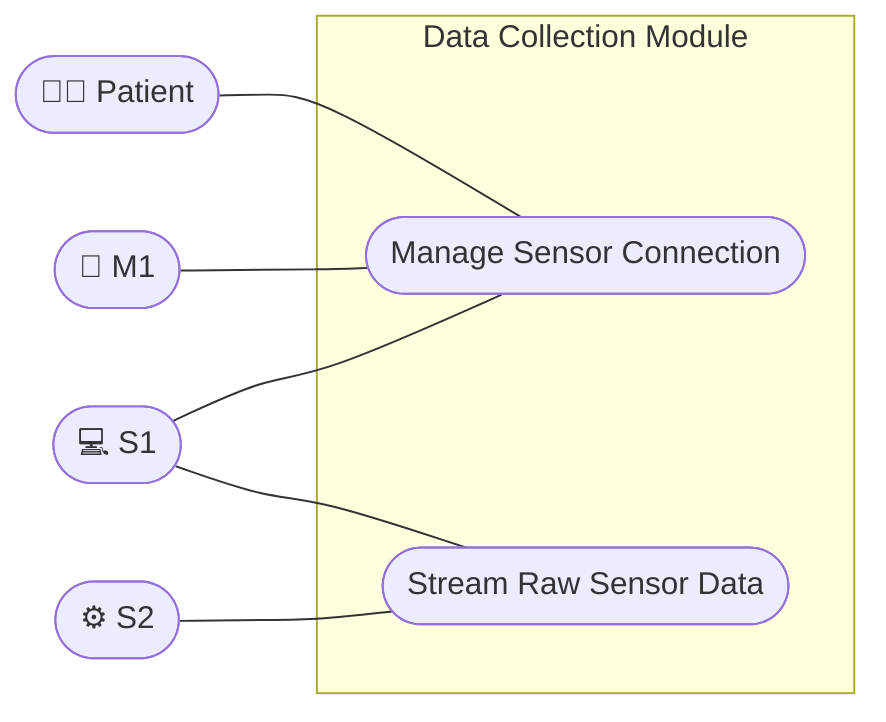

# Team S1 Software Requirement Specification

Project: Limb Motion Recognition and Assistant
Programme: DSD 2025-2026
Partners: UTAD × Jilin University

---

## Part 1 Introduction

### 1. System Overview

Physical rehabilitation often suffers from a lack of objective, measurable data when patients practice at home. The **Intelligent Limb Motion Rehabilitation Platform** bridges this gap by merging IoT (Internet of Things) with Cloud AI. By outfitting patients with wearable Inertial Measurement Units (IMUs), the system continuously monitors joint angles, evaluates them against clinical baselines using artificial intelligence, and corrects postures in real-time. 

Team S1 is specifically responsible for the hardware-level motion tracking subsystem.

### 2. Scope

This document defines the software requirements for the S1 Data Collection module, a component of the Limb Motion Recognition and Assistant system developed under the DSD 2025–2026 programme (UTAD × Jilin University).

The S1 module manages sensor connectivity, acquires raw sensor telemetry, and structures the output for subsequent processing by S2. It encompasses the following functional requirements:

- **Sensor Connection Management:** Process connection requests from M1 and establish secure communication links with designated sensors.
- **Connection Status Monitoring:** Continuously poll the connectivity state of active sensors and report hardware exceptions or disconnections in real-time.
- **Data Acquisition:** Retrieve raw telemetry data from connected sensors and stream the payloads to S2.

Internal interactions with the Sensor subsystem (S2) and the Mobile Application (M1) are detailed in the Internal Use Cases (Part 3).

The following are out of scope for S1:
- Data processing(handled by S2).
- User-facing interfaces and rehabilitation workflow (handled by M1).
- Server-side data persistence, AI model training, and recommendation engine (handled by V2 and V1).

### 3. Revision History

| Date | Author | Description | Document Link |
| :--- | :--- | :--- | :--- |
| Apr 1 | Zhihang Yu | Draft User Register details | |
| Apr 3 | Zhihang Yu, Derui Tang, Haoqi Sheng, Mofan Xu, Silva André | Held group meeting to finalize project roadmap, wireless sensor implementation, and Sprint 1 core deliverables | [Requirement analysis version 0.1 (draft)](#/releases/sprint-requirement-1) |
| Apr 18 | Derui Tang | Focus on our group's requirement to update the Software Requirement Specification. | [Software Requirements Specification version 0.2](#/releases/SRS-public) |
| Apr 27 | Derui Tang | Updated the Software Requirements Specification according to Yiding Wang's requirement. | [Software Requirements Specification Version 0.3](#/releases/0427srs) |

### 4. Glossary

| Term | Definition | Abbreviation/Alias | Remarks |
| :--- | :--- | :--- | :--- |
| Raw Sensor Data | Sensor data collected by S1. | | The data collected by S1. |
| Formal Sensor Data | Sensor data processed by S2. | | The data collected by S1 is called raw sensor data, and S2 processes the raw sensor data to obtain the Formal sensor data |
| Connection Status | Whether the sensor is connected or disconnected with the device. | | Tells patient whether the sensor has successfully connected with the device. There are only 2 status, connected and disconnected. |
| Rehabilitation Session | A discrete period of training during which sensor data is actively collected, processed, and streamed. | Session | Core unit of a patient's training activity. |
| Rehabilitation Session Meta Data | Meta information determined and fixed at the start of a session, including the rehabilitation training category, etc. | Session Meta Data | Key information of a session. |
| Token | A digital credential returned by V2 upon successful authentication, used by M1 to maintain the patient's logged-in state. | Login Token | Used in Register and Log In use cases. |

### 5. References

| No. | Document Name | Source | Summary | Link |
| :--- | :--- | :--- | :--- | :--- |
| 1 | Requirements_Analysis_Sample_EN | M1 | SRS format specification | [Raw file](./assets/releases/Requirements_Analysis_Sample_EN.md) |
| 2 | S2 SRS | S2 | Team S2's SRS. Referred to their requirements regarding integration with our team. | [S2 SRS](https://rsdbkhusky.github.io/DSD2026_TeamS2/news/srs-update.html) |
| 3 | V2 Homepage | V2 | Team V2's homepage. Referred to their description of the overall project. | [V2 Homepage](https://smonizzzz.github.io/dsd2026-teamv2/index.html#background) |
| 4 | M1 SRS | M1 | Team M1's SRS. Referred to their requirements for External Use Cases. | [M1 SRS](https://diogopinhel.github.io/DSD2026_TeamM1/2026/04/27/M1_SRS_v1.3.html) |
| 5 | M2 SRS | M2 | Team M2's SRS. Referred to their requirements for External Use Cases. | Pending update |

*Notice: You can click the links in the final column to view the reference documents.*

## Part 2 External Use Cases

Our team is not directly responsible for External Use Cases.

For more details regarding External Use Cases, please refer to [Team M1's SRS](https://diogopinhel.github.io/DSD2026_TeamM1/2026/04/27/M1_SRS_v1.3.html) and Team M2's SRS.

## Part 3 Internal Use Cases

### 1. Actor Table

| Actor | Description |
| :--- | :--- |
| S1 | Sensor team, a part of the application, responsible for basic sensor operations. |
| S2 | Sensor data processing team, a part of the application, responsible for processing formal sensor data from S1. |
| M1 | Mobile application group, the main body of the application. |
| Patient | External business participant. |

### 2. Use Case Table

| Use Case ID | Use Case Name | Primary Actors | Brief Description |
| :--- | :--- | :--- | :--- |
| IUC-S1-M1-01 | Connect Sensor | Patient, M1, S1 | M1 scans for sensors via S1, displays the list, and lets the patient to connect sensors. |
| IUC-S1-S2-01 | Deliver Raw Sensor Data | S1, S2 | S2 calls S1's deliver raw sensor data method. S1 provides data in a sequence of time. If any sensor goes wrong, the reading process stops and returns an error signal to S2. |

### 3. Detailed Use Cases

#### IUC-S1-M1-01 Connect Sensor

| Element | Description |
| :--- | :--- |
| **Reference** | IUC-S1-M1-01 |
| **Actors** | Patient, M1, S1 |
| **Goal** | Establish a connection between the application and sensors. |
| **Summary** | M1 scans for sensors via S1, displays the list, and lets the patient connect or disconnect a chosen sensor. |
| **Trigger** | Patient enters the rehabilitation page and clicks "Connect Sensor". |
| **Precondition** | The patient has powered on the sensor and entered the app. |
| **Postconditions** | The specified sensor is connected/disconnected, and the application returns to the rehabilitation page. |

**Basic Flow**

| Step | Patient | M1 | S1 |
| :--- | :--- | :--- | :--- |
| 1 | Clicks "Connect Sensor". | | |
| 2 | | Periodically requests the sensor list from S1. | |
| 3 | | | Scans for nearby sensors. |
| 4 | | | Continuously monitors the connectivity state of registered sensors. |
| 5 | | | Returns the sensor list to M1. |
| 6 | | Displays the sensor list to the patient. | |
| 7 | Selects a sensor. | | |
| 8 | | Displays a "Connect" or "Disconnect" button for the selected sensor. | |
| 9 | Clicks "Connect" or "Disconnect". | | |
| 10 | | Sends a "connect" or "disconnect" request for the chosen sensor to S1. | |
| 11 | | | Executes the connect or disconnect operation. |
| 12 | | | Returns the updated sensor list to M1. |
| 13 | | Updates the displayed sensor list. | |
| 14 | Clicks "Exit". | | |
| 15 | | Returns to the rehabilitation page. | |

**Alternative Flow**

| Occurrence Step | Condition | System Response |
| :--- | :--- | :--- |
| 4 | A sensor encounters an issue that changes its connection status. | S1 sends a signal to M1 detailing which sensor's status has changed. M1 then updates the sensor list according to S1's message. |
| 11 | S1 takes an extended time to execute the connect or disconnect operation. | M1 disables interaction with the sensor list (e.g., buttons become unresponsive) but still allows the patient to exit via a dedicated exit control. |
| 13 | After the sensor list is updated, the patient does not want to exit. | The flow returns to step 2, allowing the patient to select another sensor and perform further connect/disconnect actions. |

#### IUC-S1-S2-01 Deliver Raw Sensor Data

| Element | Description |
| :--- | :--- |
| **Reference** | IUC-S1-S2-01 |
| **Actors** | S1, S2 |
| **Goal** | Allow S1 to obtain raw sensor data. |
| **Summary** | S2 calls S1's deliver raw sensor data method. S2 completes finalization and returns a confirmation signal to M1; otherwise returns an error signal. |
| **Trigger** | Periodically called by S2's internal logic. |
| **Precondition** | The sensors are already connected and S2 sends the start reading signal to S1. |
| **Postconditions** | S1 returns the result or error to S2. |

**Basic Flow**

| Step | S2 | S1 |
| :--- | :--- | :--- |
| 1 | S2 calls S1's deliver raw sensor data method. | |
| 2 | | S1 starts reading sensor data continuously. |
| 3 | S2 asks S1 to stop reading and send the collected data. | |
| 4 | | S1 stops reading data and sends the collected data to S2. |
| 5 | S2 receives the raw sensor data and proceeds with the next steps. | |

**Alternative Flow**

| Occurrence Step | Condition | System Response |
| :--- | :--- | :--- |
| 2 | A sensor encounters a hardware fault or connection drop. | S1 aborts the acquisition loop and throws an error exception to S2 in lieu of the standard data payload. |

## Part 4 Others

### 1. Business Assumptions

| ID | Assumption |
| :--- | :--- |
| A-S1-01 | Target devices are HarmonyOS smartphones. |
| A-S1-02 | All sensors must be fixed at the pre-agreed positions. |

### 2. Internal Use Case Diagram

